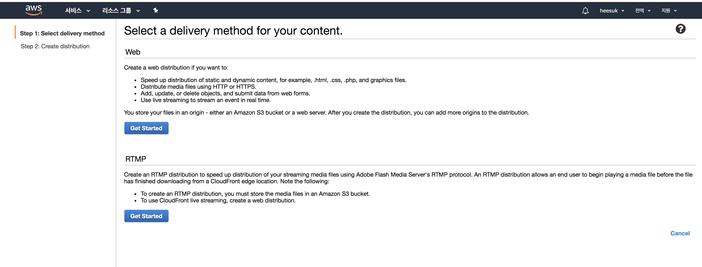
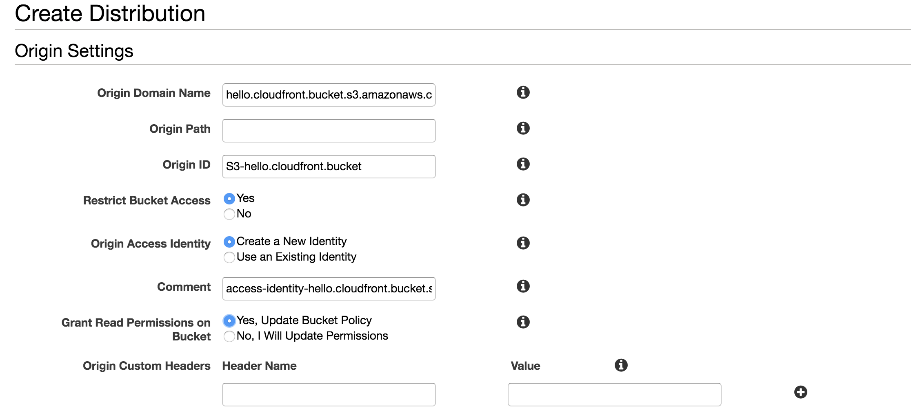
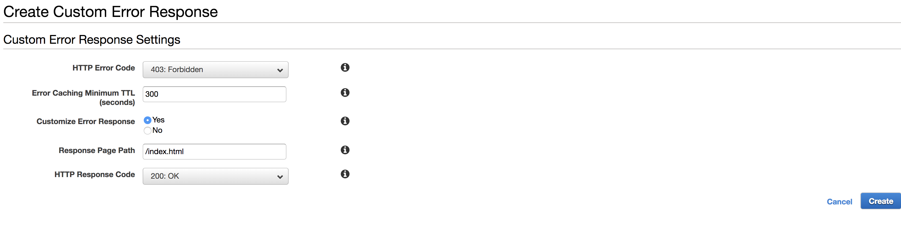

안녕하세요, 백엔드 개발자 안희석입니다.
오늘은 cloudfront와 s3를 이용하여 정적 웹페이지를 배포하는 것에 대해서 정리해보려 합니다.
기존에 s3에 정적 웹페이지를 올린 후, 호스팅하는 것에 대해서는 알고 있었지만, s3에 올리는 정적 웹
페이지에 ssl을 적용하는 방법을 알아보다가 aws에서 서비스하는 cloudfront를 알게되어 배포하면서
알게된 부분을 공유하고자 글을 정리합니다.

## cloudfront란?

아마존의 클라우드 프론트 서비스를 간단하게 설명하자면 CDN으로 content delivery network를 의
미합니다.

content delivery network 기술은 기하급수적으로 늘어나는 트래픽들로 인해 컨텐츠 전송 과정에
서 빈번하게 트래픽 집중 및 병목 현상등이 발생하였는데, 이런 문제를 지역별로 컨텐츠를 분산시키고
네트워크 경로상 가장 가까운 곳의 서버로부터 컨텐츠를 전송받도록 하여 트래픽을 분산하도록 하는 기술입
니다.

클라우드 프론트 서비스도 전세계에 '엣지 위치'라고하는 데이터 센터의 전 세계 네트워크를 통해 콘텐츠
를 제공합니다.

이러한 클라우드 프론트를 사용하면 아무래도 전세계에서 접근하는 전반적인 웹페이지 로드속도에 대한
개선이 가능할 것이라고 생각했습니다.

## cloudfront와 S3

cloud front는 s3의 정적 웹페이지와 연동이 가능합니다. s3에 있는 bucket 오브젝트를 읽어들여서
cloud front에서 해당 오브젝트를 전세계에 존재하는 캐시서버에 저장을 하게됩니다.
그리고 유저로부터 해당 페이지 요청이 들어오게되면 가장 가까운 캐시서버에 저장된 컨텐츠를 받게 됩니다. 그럼 아래에서부터 어떤식으로 설정하는지 확인해보도록 하겠습니다.

## step 1) s3에 버킷을 생성하자.


먼저, 클라우드프론트를 설정하기에 앞서 s3에 버킷을 생성하고 해당 버킷에 index.html 파일을 넣도록 하겠습니다. 테스트이기 때문에 저는 간단한 html 문서를 넣으려고 합니다.

'''
<html>
  <body>
    헬로우 cloud front!
  </body>
</html>
'''

위와 같은 index.html을 s3에 버킷을 생성하여 넣습니다.

## step 2) cloudfront를 생성하자.



cloudfront 서비스에 들어가서 `create destribution`을 누르면 위와 같이 WEB과 RTMP 둘중에 선택을 할 수 있습니다.
저희는 WEB 배포를 할 것이므로 WEB 밑에 `Get Started`를 눌러줍니다.



그러면 위와 같은 화면에서 설정을 할 수 있습니다. 하나씩 살펴보도록 하겠습니다.

## Origin Settings

# Origin Domain Name

먼저 오리진 도메인 네임은 실제 클라우드 프론트의 원본이 되는 서비스에 대해서 선택을 하는 곳입니다.
저희는 이미 이전에 s3에 버킷을 생성을 미리 해놨기 때문에, 드롭다운을 눌러보면 리스트에 나오는 것을 확인할 수 있습니다.

# Orgin Path

origin path의 경우는 요청에 대해서 prefix를 붙일경우에 사용합니다. 예를 들어서, 버킷 안에 dist라는 디렉토리가 있고
그 디렉토리 안에 index.html 파일이 있다고 가정해봅시다.
그 경우 클라우드 프론트에 들어오는 요청에 항상 dist 디렉토리 안을 root로 보려면
'Origin Path'에 '/dist'를 넣어줍니다. 이 경우, 클라우드 프론트에 모든 요청은 root를 dist 아래 단계에서부터 보게 됩니다.

# Origin ID

배포내에서 오리진을 식별하기위한 유일한 키값입니다.

# Restrict Bucket Access

만약, 버킷내에 정적파일을 호스팅하게 되면 호스팅하고나서 얻게되는 URL이 있습니다. 이 URL로 유저가 접속하는 것이 아니라,
항상 cloudFront를 통해서 접속하게 할때 Yes를 누릅니다.

# Origin Access Identity

Restrict Bucket Access에서 Yes를 누를 경우, OAI를 생성할 수 있습니다. 이것은 s3 버킷내에 GetObject 권한을
설정하는데에 도움을 줍니다. 여기서는 최초 설정이기 때문에 'create a new Identity'를 눌러줍니다.

# Grant Read Permissions on Bucket

cloudFront가 배포될 때, Bucket에 Read Permission을 자동적으로 얻기 위한 설정입니다. yes를 선택합니다.

## Default Cache Behavior Settings


# Object Caching

엣지 로케이션에서 기본적으로 24시간동안 컨텐츠를 저장하고 있습니다. 이 말이 무엇이냐면, 만약 오리진(s3 bucket)에서
index-v1.html을 배포했다고 해봅시다. 그리고 약 6시간 뒤에 index-v2.html을 배포할 경우, 실제로 배포된 웹페이지에 접속을 해보면, update가 되어있지 않습니다.
 그 이유는 요청이 들어오면 cloudFront에서는 엣지 로케이션에 캐시가 있는지 먼저 보고, 캐시가 있다면 엣지 로케이션에서
 저장된 컨텐츠를 돌려주기 때문입니다. 이 시간의 기본설정이 24시간입니다.

이에 대한 장점은 가용성이 좋다는 점인데, 혹시나 s3에 모든 파일이 날라간다 하더라도 캐시에는 저장된 데이터가 있기 때문에
페이지 접속에 문제는 없습니다.

또 단점이라고 생각한다면 즉각적으로 배포를 할 수 없다는 것인데, 이에 대한것은 아래에서 'invalidation (무효화)'를 통해
캐시 서버에 저장된 컨텐츠들을 지우고 새로운 버젼으로 업데이트 하는 것에 대해 작성하도록 하겠습니다.

# Viewer Protocol Policy

실제 유저의 프로토콜 정책을 수립합니다. 여기서 저는 'Redirect http to https'를 선택하였는데, 그 이유는
만약 유저가 http로 클라우드 프론트에 접속한다 하더라도 https로 자동 리다이렉트 되게 하기 위해서입니다.
ssl 설정을 하지 않으실거라면, Http and Https로 설정하셔도 무방합니다.

# Compress Objects Automatically

이것은 컨텐츠들을 자동으로 gzip으로 압축할 것인지에 대한 설정입니다. 만약 이 설정이 되어 있으면 요청에 Accept-Encoding: gzip이 있다면, 압축할 수 있는 컨텐츠는 압축하여 유저에게 반환합니다.
 당연히 컨텐츠의 사이즈가 줄기 때문에 응답속도가 더 좋아질 수 있습니다. cloudFront는 압축된 컨텐츠를 엣지 로케이션에 저장하는데, 만약 엣지 로케이션에 압축된 컨텐츠가 없을 경우, 오리진으로부터 컨텐츠를 받아온 후, 엣지 로케이션에서 gzip으로 압축하여 저장합니다.

## Distribution Settings

# Price Class

Price class에 따라서 가격이 좀 더 비싸질수도 있습니다. 성능이 좋기로는 모든 엣지 로케이션 설정하는 것이 좋지만,
꼭 전 세계에 딜리버해야하는 서비스가 아닐 경우는 US, Canada, Eu, Asia, Africa 설정만 선택해도 충분합니다.

# Alternate Domain Names

이 부분은 중요합니다. Route 53에서 도메인을 관리할 때, Alias에 CloudFront url이 노출되기 위해서는 이 Cname에
사용할 도메인을 입력해주어야 합니다. 만약 여러 CNAME을 사용할 경우는 콤마를 통해 분리할 수 있는데,
예를 들어,

```
  www.example.com, exmple.com
```

위와 같이 2개의 도메인을 등록할수도 있습니다. Route53에서 해당 Record set을 등록하는 것은 CloudFront 생성 이후에
진행하도록 하겠습니다.

# SSL Certificate

도메인에 ssl을 적용하기 위해서 ssl 인증서를 등록할 수 있습니다. 이 경우에 만약 본인의 도메인에 맞게 하기 위해서는
ACM (Amazon Certificate Manager)서비스에 미리 ssl 인증서를 등록하여야 사용할 수 있습니다.

# Default Root Object

cloudFront url로 접속할 때, 기본적으로 root object를 설정할 수 있습니다. 저희는 root object가 `index.html`
이므로, index.html을 적어주면 됩니다.

# Distribution State

Enabled로 설정하면 해당 배포를 생성하자마자 배포가 시작됩니다.

## 생성 후, 실제 CloudFront 배포는 약 15분에서 20분정도 소요됩니다.

생각보다 시간이 오래걸립니다. cloudFront의 destribution 리스트를 살펴보면 저희가 막 생성한 배포의 status가
`In Progress`로 나와있는 것을 확인할 수 있습니다. 이것이 `Deployed`로 바뀐다면 배포가 완료되며, 이후에
`Domain Name`에 있는 url로 접속을 시도하면 성공적으로 접속이 되는 것을 확인할 수 있습니다.


## Route53 도메인과 CloudFront 연결하기

그러나, 저희가 실제로 서비스에서 사용하기에 cloudFront URL은 사용하기가 어렵기 때문에, Route53에서 도메인을 등록한 후, 해당 도메인을 CloudFront와 연결을 해주어야 합니다.

Route53에서 `Create Record Set`을 누른 후, Name에 원하는 도메인 명을 입력 해 주시고,
Type은 A-IPv4 address를 선택해 줍니다. 그리고 `Alias`를 yes를 눌러주신 후, Alias Target에
drop down을 확인해보시면, cloudFront url을 확인할 수 있습니다.

여기에 cloudFront url이 활성화 될 수 있는 이유는 저희가 아까 cloudFront에 cname을 미리
등록해놨기 때문에 활성화 되는 것입니다.

이후 Routing Policy는 Simple로 해놓으시고, Evaluate Target Health도 `No`로 해놓으신 후,
`Save Record Set`으로 저장을 해주시면 됩니다.

이제 저장된 도메인으로 접속하게되면 cloudFront를 통해서 접속이 되게 되며, ssl 인증서를 도메인과 일치하는 것으로
등록을 해놓으셨다면, https로 접속도 가능하게 됩니다.

## 배포 적용을 위한 invalidation (무효화) 적용하기

이후 배포를 하고나시면, 엣지 로케이션들에 캐시된 컨텐츠들이 있기 때문에 마치 아무 적용도 되지않은 것 처럼
여겨지실 수 있습니다. 그러나, 첫 배포후 24시간 뒤면 엣지 로케이션들이 오리진에 있는 컨텐츠들을 가져가서 다시
캐싱을 하므로, 업데이트는 되지만, 그 시간동안 기다릴 수 없는 경우는 바로 적용도 할 수 있습니다.

바로 적용하기 위해서, 배포된 cloudFront를 누르고 상단에 'Distribution Setting'을 누릅니다.
그 후, 상단 탭중 'invalidations'를 눌러주시면 무효화 패턴을 적용할 수 있습니다.

무효화패턴을 생성하기 위해서 'Create invalidation'을 눌러 주신후 모든 s3 객체에 대해서 적용하기 위해

```
/*
```

위와 같은 무효화 패턴을 적고 저장을 합니다. 그러면 약 5분 내로 모든 엣지로케이션에서 origin에 배포된
것으로 업데이트를 하게됩니다.

무효화 방법의 경우, 한달에 약 무효화 패턴 1000개까지는 무료로 제공되지만, 그 이상은 요금이 과금됩니다.
또한, 만약 cloudFront Distribution이 3개가 있다고 가정하고, 각각 한달에 600개씩 무효화 패턴을
생성하였다면, 총 1800개가 되므로, 여기에서 800개의 무효화 패턴 요금이 부과되므로 주의하시기 바랍니다.

이때 또 무효화 패턴을 적용한 파일의 갯수만큼 카운터 되는것이 아니라 /image/test.jpg나 /* 이 두개다
하나의 무효화 패턴으로 취급이 됩니다.

즉, /* 로 모든 버킷의 무효화 패턴을 적용하였다고 해서, 파일의 갯수만큼 차감되는 것이 아니므로 걱정
안하셔도 됩니다.

또 중요한 점은, 무효화 패턴은 버킷에 새로운 버젼 업데이트를 할때마다, 무효화 패턴을 다시 생성을 해주어야
적용이 된다는 점을 알아두셔야 합니다.

물론 이런 방법이 귀찮을 수 있기 때문에, CI/CD를 사용하신다면, AWS SDK를 이용해서 invalidation을
배포 후에 항상 생성하게 하시면 좀 더 편하게 사용하실 수 있을 것 같습니다.

## SPA (Single Page Application)의 경우 주의할점과 에러 핸들링

SPA의 경우, 만약 하위 패스로 직접적으로 url에 접속하려고 할 경우, 403 에러가 화면에 나타날 수 있습니다.
즉 예를 들어서 아래와 같은 페이지가 있다고 해봅시다.

```
www.example.com
www.example.com/company
```

일반적으로 생각해 봤을 때, 웹 브라우저에 위의 두 url을 입력하면 바로 이동이 될 것이라고 생각됩니다.
하지만, www.example.com/company의 경우에는 403에러를 보게되실겁니다.

이는 왜냐하면, cloudFront가 실제 하위 패스에 대해서 s3 bucket에 접근하여 해당 파일이 있는지 찾기 때문인데,
SPA의 경우에는 실제로 물리적인 path에 매칭되는 file이 존재하지 않기 때문에, 403 에러가 돌아오게 됩니다.

이러한 경우 항상 SPA는 index.html이 있어야 해당 라우팅 로직이 적용될 수 있는데, 주로 SPA에서
vue의 경우에는 vue router가 있을 것이고, react의 경우에는 react router가 있을 겁니다.

그러면 이를 어떻게 해결할 수 있을까요? 방법은 생각 외로 간단합니다.

저희가 배포한 cloudFront의 `Ditstribution setting`에 들어가보면 `Error Pages` 탭이 있는데,
이 탭을 눌러서 발생한 에러에 대해서 핸들링을 해주면 됩니다.

Create Custom Error Response를 누르신 후, 아래와 같이 룰을 생성하시면 됩니다.



위와 같이 400에러나 404에러도 설정해주시면 됩니다.
그 후, 실제로 하위 패스로 직접적으로 접속을 해도 페이지에 403이 아니라, 실제 /company 페이지를 보실 수 있을 겁니다.
